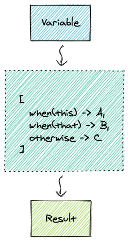

# Lodash Patterns

 

Mini pattern matching tool leveraging lodash methods. Written in typescript



## Installation

Note: Lodash is not included in the module, and has to be installed separately

```bash
npm install --save lodash-patterns lodash
```

## Usage

### Base usage

```typescript
import { when, matcher } from 'lodash-patterns'

const detectErrorType = matcher(
  [when("has", "body.errors"), () => "ApiError"],
  [when("isString"), () => "ServerError"],
  [when("isMatch", { message: 'unknown' }), () => "UnknownError"],
  () => "Internal Error" // fallback
)

const errorType = detectErrorType({ message: 'unknown' })
```

### Negative matchers

#### `when.not(...)`

```typescript
import { matcher, when } from '../index'

const isRecordValid = matcher(
  [when.not('isObject'),        () => false],
  [when.not('has', 'username'), () => false],
  () => true
)
```

### Language helpers

#### `otherwise(resolver)`

```typescript
import { when, matcher, otherwise } from 'lodash-patterns'

const detectErrorType = matcher(
  [when("has", "body.errors"), () => "ApiError"],
  otherwise(() => "Unknown Error")
)

const errorType = detectErrorType("oh no")
```

#### `use(value)`

Creates a function that returns the value specified

```typescript
import { when, matcher, otherwise, use } from 'lodash-patterns'

const movieOf = matcher(
  [when("isEqual", "john travolta"), use("pulp fiction")],
  [when("isEqual", "tom hanks"), use("the terminal")],
  [when("isEqual", "morgan freeman"), use("shawshank")],
  otherwise(use('no movie found'))
)

const movie = movieOf("tom hanks")
```

Available aliases:
- `value(value)`

#### `good` and `bad`

Simple functions that return respectively `true` and `false`

```typescript
import { matcher, when, otherwise, bad, good } from '../index'

const isRecordValid = matcher(
  [when.not('isObject'),        bad],
  [when.not('has', 'username'), bad],
  [when.not('has', 'email'),    bad],
  [when('thru', (record) => (<any>record).username.length < 8), bad],
  otherwise(good)
)

isRecordValid({ username: 'jeffgoldblum', email: 'jeff@goldblum.com'}) // true
```

Available aliases:
- `yes`
- `no`

## Development

### Install dependencies

```bash
npm install
```
### Running tests

```bash
npm run test
```

